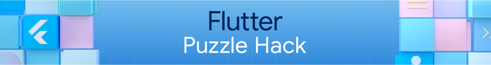
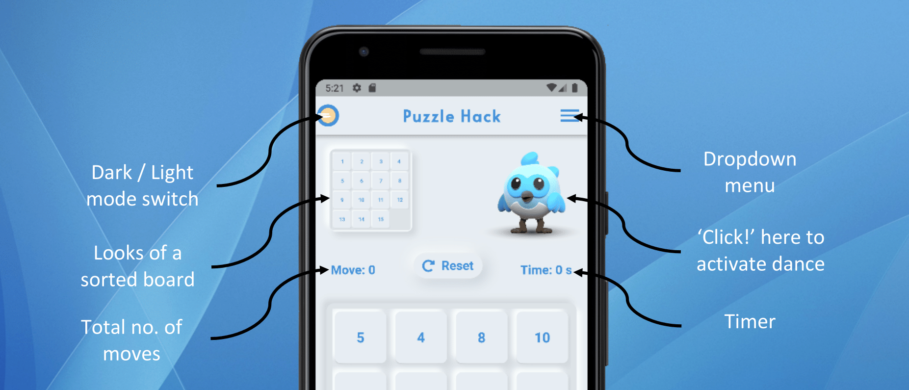
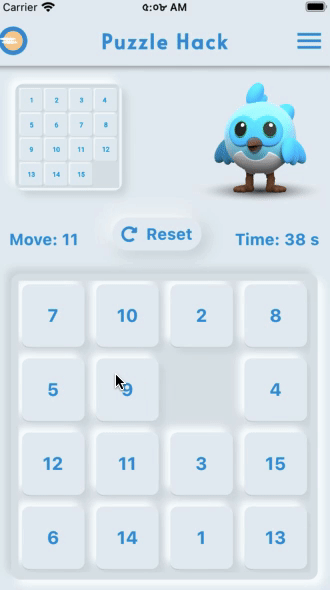
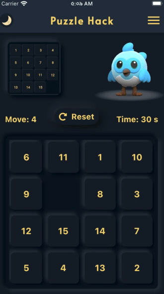
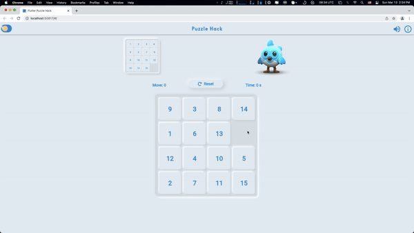

# Flutter Puzzle Hack

&nbsp;&nbsp;
&nbsp;&nbsp;
<a href="https://choosealicense.com/licenses/mit/" target="_blank"></a>&nbsp;&nbsp;


</img>

A new Flutter project.

## Guide

<p align="center">
    </img>
</p>

## Demo

<table align="center" style="margin: 0px auto;">
  <tr>
    <th>Light Mode (iPhone 8 Simulator)</th>
    <th>Dark Mode (iPhone 8 Simulator)</th>
  </tr>
  <tr>
    <td></img></td>
    <td></img></td>
  </tr>
  </table>
  <br>
<table align="center" style="margin: 0px auto;">
  <tr>
    <th>Google Chrome</th>
  </tr>
  <tr>
    <td></img></td>
  </tr>
  </table>

## File Pattern Inside The `'lib'` Folder

```
lib
├── app
│   ├── provider
│   │   ├── appinfo_provider.dart
│   │   ├── sound_provider.dart
│   │   └── theme_provider.dart
│   ├── view
│   │   └── puzzle_game.dart
│   ├── widget
│   │   ├── util
│   │   │   ├── design
│   │   │   │   ├── arrow_clipper.dart
│   │   │   │   └── neumorphic_button.dart
│   │   │   ├── dropdown_menu.dart
│   │   │   ├── grid_container.dart
│   │   │   ├── move.dart
│   │   │   ├── reset_button.dart
│   │   │   └── timer.dart
│   │   ├── grid.dart
│   │   ├── menu_items.dart
│   │   ├── picture_and_animation_row.dart
│   │   ├── top_appbar.dart
│   │   └── winning_card.dart
│   └── .DS_Store
├── generated_plugin_registrant.dart
└── main.dart
```
