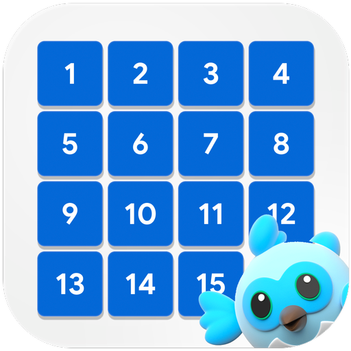

&nbsp;&nbsp;
&nbsp;&nbsp;
<a href="https://choosealicense.com/licenses/mit/" target="_blank"></a>&nbsp;&nbsp;


# Flutter Puzzle Hack

</img>

A new Flutter project.

## Folder & File Directory

```
lib
├── app
│   ├── provider
│   │   ├── sound_provider.dart
│   │   └── theme_provider.dart
│   ├── view
│   │   └── puzzle_game.dart
│   ├── widget
│   │   ├── util
│   │   │   ├── design
│   │   │   │   ├── arrow_clipper.dart
│   │   │   │   └── neumorphic_button.dart
│   │   │   ├── dropdown_menu.dart
│   │   │   ├── grid_container.dart
│   │   │   ├── move.dart
│   │   │   ├── reset_button.dart
│   │   │   └── timer.dart
│   │   ├── grid.dart
│   │   ├── menu_items.dart
│   │   └── top_appbar.dart
├── generated_plugin_registrant.dart
└── main.dart
```
